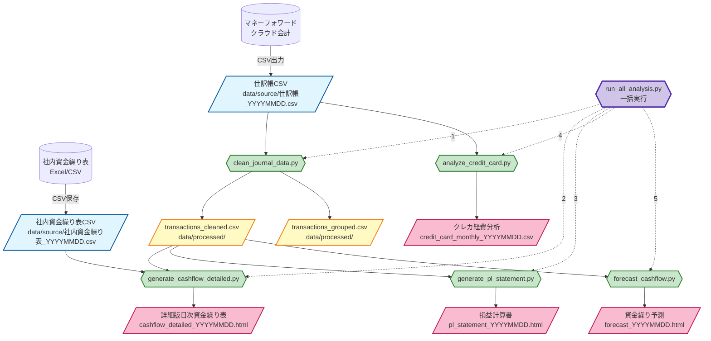

# データフロー図

finance-cashflowプロジェクトのデータフロー全体像

## 全体フロー（Mermaid図）



---

## 各処理の詳細

### 1. データソース

| ソース | ファイル名 | 説明 | 配置場所 |
|--------|-----------|------|----------|
| マネーフォワード | `仕訳帳_YYYYMMDD_HHMM.csv` | 全取引の仕訳データ | `data/source/` |
| 社内管理 | `社内資金繰り表_YYYYMMDD.csv` | 実残高データ（オプション） | `data/source/` |

**取得方法:**
- マネーフォワード: 会計 → 帳票 → 仕訳帳 → CSV出力（Shift-JIS）
- 社内資金繰り表: Excelから手動でCSV保存

---

### 2. データクリーニング（clean_journal_data.py）

**入力:**
- `data/source/仕訳帳_YYYYMMDD_HHMM.csv`

**処理内容:**
1. 文字コード変換（Shift-JIS → UTF-8）
2. 不要列の削除
3. 日付の標準化
4. 金額のnull処理（0埋め）
5. 空白・改行のクリーニング
6. 取引単位での集約（複合仕訳対応）
7. 金額整合性チェック

**出力:**
- `data/processed/transactions_cleaned.csv` - 明細単位のクリーンデータ
- `data/processed/transactions_grouped.csv` - 取引単位の集約データ
- `data/processed/cleaning_report.txt` - 処理レポート

---

### 3. 詳細版資金繰り表（generate_cashflow_detailed.py）

**入力:**
- `data/processed/transactions_cleaned.csv`
- `data/source/社内資金繰り表_YYYYMMDD.csv`（オプション）

**処理内容:**
1. 取引を収入・支出・税金に分類
2. クレジットカード決済を特定
3. カード名（アメックス、セゾンなど）を記録
4. 日別に集計
5. 残高計算（実残高で補正）
6. HTML形式でレポート生成

**出力:**
- `data/reports/cashflow_detailed_YYYYMMDD.html` - 日次資金繰り表

**特徴:**
- 💳マークでクレカ決済を表示
- カード名を列ごとに表示（Google広告💳アメックス など）
- 実残高との差異を自動補正

---

### 4. 損益計算書（generate_pl_statement.py）

**入力:**
- `data/processed/transactions_cleaned.csv`

**処理内容:**
1. 収益科目を抽出（売上高、雑収入など）
2. 費用科目を抽出（仕入、給料、広告費など）
3. 月別に集計
4. 営業利益・経常利益を計算
5. HTML形式でレポート生成

**出力:**
- `data/reports/pl_statement_YYYYMMDD.html` - 月次損益計算書

**特徴:**
- 月別推移グラフ
- 赤字月を警告表示
- 科目別の内訳

---

### 5. クレカ経費分析（analyze_credit_card.py）

**入力:**
- `data/source/仕訳帳_YYYYMMDD_HHMM.csv`（直接読み込み）

**処理内容:**
1. 未払金取引（クレカ決済）を抽出
2. カード別・サービス別に分類
3. 月別に集計
4. CSV形式で出力

**出力:**
- `data/credit_card_monthly_YYYYMMDD.csv` - クレカ経費集計

**分類対象:**
- カード: アメックス、セゾン、三井住友、TS CUBIC、しんきんカード など
- サービス: Google広告、Yahoo広告、Amazon、LINE広告 など

---

### 6. 資金繰り予測（forecast_cashflow.py）

**入力:**
- `data/processed/transactions_cleaned.csv`

**処理内容:**
1. 過去90日間のデータを抽出
2. 主要項目の月平均を算出
   - 収入: Back Market売上、店舗売上、その他売上
   - 支出: Google広告、Yahoo広告、仕入、給料、役員報酬
3. 現在残高を推定
4. 30日後の残高を予測
5. 資金ショートリスクを判定
6. HTML形式でレポート生成

**出力:**
- `data/reports/forecast_YYYYMMDD.html` - 資金繰り予測レポート

**警告レベル:**
- 🔴 500万円以下: 資金ショートリスク
- 🟡 1000万円以下: 注意

---

### 7. 統合実行（run_all_analysis.py）

**目的:** 上記すべてのスクリプトを自動実行

**実行順序:**
1. データ確認（仕訳帳CSVの存在確認）
2. データクリーニング
3. 詳細版資金繰り表生成
4. 損益計算書生成
5. クレカ経費分析
6. 資金繰り予測

**使い方:**
```bash
cd work/finance-cashflow
uv run python scripts/run_all_analysis.py
```

または、スラッシュコマンド:
```
/cash-analyze
```

---

## スラッシュコマンド一覧

Claude Codeで使用できるコマンド:

| コマンド | 説明 | 実行内容 |
|---------|------|---------|
| `/cash-analyze` | 資金繰り分析を実行 | 全スクリプトを一括実行 |
| `/cash-forecast` | 資金繰り予測を実行 | 予測スクリプトのみ実行 |
| `/card-optimize` | カード払い最適化判断 | 対話型で最適カードを判断 |

---

## ディレクトリ構成

```
finance-cashflow/
├── data/
│   ├── source/           # 元データ（ユーザーが配置）
│   │   ├── 仕訳帳_YYYYMMDD_HHMM.csv
│   │   └── 社内資金繰り表_YYYYMMDD.csv
│   ├── processed/        # 整形済みデータ（自動生成）
│   │   ├── transactions_cleaned.csv
│   │   ├── transactions_grouped.csv
│   │   └── cleaning_report.txt
│   ├── proposals/        # カード払い提案書（対話で生成）
│   │   └── YYYY-MM-DD_提案内容.md
│   └── reports/          # 各種レポート（自動生成）
│       ├── cashflow_detailed_YYYYMMDD.html
│       ├── pl_statement_YYYYMMDD.html
│       ├── forecast_YYYYMMDD.html
│       └── credit_card_monthly_YYYYMMDD.csv
├── scripts/
│   ├── clean_journal_data.py
│   ├── generate_cashflow_detailed.py
│   ├── generate_pl_statement.py
│   ├── analyze_credit_card.py
│   ├── forecast_cashflow.py
│   └── run_all_analysis.py
├── docs/
│   ├── master-data.md       # カード・支払先マスター
│   ├── decision-rules.md    # カード選択判断ルール
│   ├── holidays.csv         # 営業日データ
│   └── data-flow.md         # このファイル
└── CLAUDE.md                # プロジェクト説明
```

---

## 実行環境

- **Python:** 3.10+
- **パッケージマネージャー:** uv
- **主要ライブラリ:** polars, pandas, plotly
- **実行方法:** `uv run python scripts/<スクリプト名>.py`

---

## トラブルシューティング

### Q1: 「仕訳帳CSVが見つかりません」エラー

**原因:** `data/source/` に仕訳帳CSVが配置されていない

**解決方法:**
1. マネーフォワードクラウド会計にログイン
2. 会計 → 帳票 → 仕訳帳
3. CSV出力（Shift-JIS）
4. ダウンロードしたファイルを `data/source/` に配置

### Q2: 金額が合わない

**原因:** 実残高データがない、または古い

**解決方法:**
1. 社内資金繰り表を最新版に更新
2. `data/source/社内資金繰り表_YYYYMMDD.csv` として保存
3. 再度分析を実行

### Q3: カード名が表示されない

**原因:** 辞書キーの不一致（修正済み）

**解決方法:** 最新版のスクリプトを使用（[generate_cashflow_detailed.py:233](generate_cashflow_detailed.py#L233)で修正済み）

---

## 更新履歴

- **2025-10-30**: データフロー図を作成
- **2025-10-30**: 統合実行スクリプト追加
- **2025-10-30**: 資金繰り予測機能を追加
- **2025-10-29**: クレカ決済のカード名表示機能を追加
- **2025-10-29**: 実残高補正機能を追加
